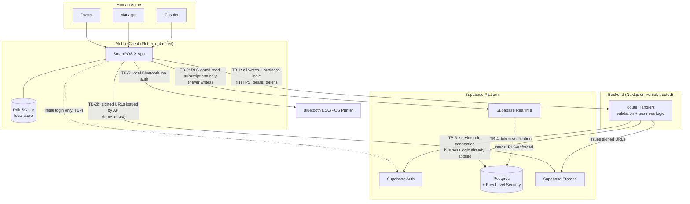

# System Context

> **Status:** 🔵 In review
> **Phase:** 04 — Software Requirement Specification
> **Version:** 0.1.0
> **Last updated:** 2026-07-30
> **Owner:** CTO
> **Approved by:** _pending_

Actors, external systems, and — the part that matters most for [Phase 12](../12-security/README.md)
— every trust boundary the architecture crosses. This document is written before Phase 07/11/12
exist in detail specifically so those phases inherit a settled boundary list rather than each
re-deriving one.

---

## 1. Human actors

| Actor | V1 status | System role(s) | Notes |
| --- | --- | --- | --- |
| Owner | V1 | Owner (superset of Manager) | Primary buyer and administrator; per [project-vision.md §7](../01-vision/project-vision.md), often also physically cashiering. |
| Manager | V1 | Manager (superset of Cashier) | Approves discounts/returns above threshold, adjusts stock, overrides day-close ([DR-020](../03-functional-requirements/business-rules.md)). |
| Cashier | V1 | Cashier | Operates the till; the persona whose speed constraints (BR-011) drive the entire POS design. |
| Inventory Staff | V1 (job function, not a system role) | Operates under Cashier or Manager | See [user-stories.md](../03-functional-requirements/user-stories.md) — a dedicated role is a plausible V2+ refinement, not a V1 gap. |
| Customer (end consumer) | V1 (passive — receives receipt) / V3 (active — QR ordering) | None in V1 (no login) | In V1 the customer never authenticates; their record is created/attached by a Cashier (BR-027). Becomes an authenticated actor only in V3's QR ordering flow. |
| Delivery Staff | Deferred to V3 | Not yet defined | Named in the founding brief; belongs to Shipping & Delivery, out of V1 scope. |
| Accountant | Deferred to V2+ | Not yet defined | Consumes exports, per [project-vision.md §6](../01-vision/project-vision.md) ("not an accounting package" — we export, we don't replace one). |

## 2. External systems

| System | Role in V1 | Trust boundary? | Deferred? |
| --- | --- | --- | --- |
| Supabase Postgres | Authoritative server-side data store, accessed via the Next.js API | Yes — TB-3 | V1 |
| Supabase Auth | Identity provider; issues/validates session tokens | Yes — TB-4 | V1 |
| Supabase Realtime | Direct client-side subscriptions for live reads (stock, orders) | Yes — TB-2 | V1 |
| Supabase Storage | Product images, receipt PDFs, via signed URLs | Yes — TB-2b | V1 |
| Vercel | Hosts the Next.js API and (later) the web admin/storefront | No (deployment target, not a data boundary) | V1 |
| Bluetooth ESC/POS printer | Paired peripheral for receipt printing | Yes — TB-5 (low severity) | V1 |
| Google Play Store | App distribution only | No | V1 |
| Firebase Cloud Messaging | Push notifications | N/A — not present in V1 | Deferred (V3+) |
| Payment gateway (Razorpay/PhonePe/etc.) | Online/QR payment processing | Yes — TB-6 (future) | Deferred (V3) |
| Map tile provider | Delivery-tracking rendering | No (read-only rendering, no sensitive data) | Deferred (V3) |

## 3. Context diagram

## 4. Trust boundaries — the list Phase 12 inherits

| ID | Boundary | Crossed by | Enforcement | Severity if broken |
| --- | --- | --- | --- | --- |
| **TB-1** | Mobile client → API | Every mutating operation and all business-logic reads | Server-side auth + role check on every endpoint ([ADR-0001](../adr/ADR-0001-hybrid-api-and-direct-realtime-access.md), DR-017) | High — this is the primary attack surface; a decompiled client is assumed hostile |
| **TB-2** | Mobile client → Supabase Realtime | Live read subscriptions only, never writes | Row Level Security is the **sole** gate here — no API layer sits in front of it | High — RLS is doing the entire job on this boundary; a missing/wrong policy leaks cross-tenant data directly |
| **TB-2b** | Mobile client → Supabase Storage | File upload/download | Short-lived signed URLs issued only by the API, never a long-lived storage credential on the client | Medium — a leaked signed URL exposes one file for a limited window, not the bucket |
| **TB-3** | API → Postgres | All server-side data access | Service-role credential, never exposed to any client; business rules (DR-001–DR-026) already applied before this boundary is crossed | High if the service-role credential itself leaks — this is a secrets-management concern (NFR-015), not a per-request one |
| **TB-4** | Client/API → Supabase Auth | Login, token refresh, token verification | Standard OAuth/JWT flow; tokens stored in platform secure storage (NFR-016) | High — this boundary is identity itself |
| **TB-5** | Mobile client → Bluetooth printer | Print commands | None beyond OS-level Bluetooth pairing | Low — receipt content is not confidential in the way credentials or payment data are; worst case is a spoofed/garbled receipt, not a data breach |
| **TB-6** | API → Payment gateway (future) | Payment initiation, webhooks | Deferred to V3; per [RR-007](../02-business-requirements/regulatory-requirements.md), the gateway carries the payment-system-operator obligation, we carry API-key custody and webhook signature verification | Not yet applicable — flagged for Phase 12 when V3 is scoped |
| **TB-7** | Physical device ↔ its own local database | Anyone with physical possession of a lost/stolen device | Assume-hostile: device storage is treated as readable by an attacker who has the device; tokens live in secure storage, not the SQLite file itself | High for that specific device's data; contained by per-device session revocation (BR-005/FR-014) — does not expose other tenants |

**The load-bearing finding here:** TB-2 has no fallback layer. Every other boundary has the API in
front of it re-checking authorisation independently; TB-2 relies on Row Level Security alone. This
is the direct, practical consequence of [ADR-0001](../adr/ADR-0001-hybrid-api-and-direct-realtime-access.md)'s
"defence in depth" claim — the depth exists everywhere except here, so Phase 12's RLS policy
correctness (NFR-019) is *the* control for TB-2, not *a* control among several.

## 5. What is explicitly out of this context (for now)

Web admin (beyond the API it shares with mobile), the QR customer-ordering storefront, and any
payment gateway integration are **V2/V3 scope**. They will add actors and boundaries to this
document when their phase starts — this document is updated then, not now, per the "one module/one
phase at a time" governance rule.

## Change Log

| Version | Date | Change |
| --- | --- | --- |
| 0.1.0 | 2026-07-30 | Initial context: 7 human/system actor rows, 7 trust boundaries, context diagram. |
