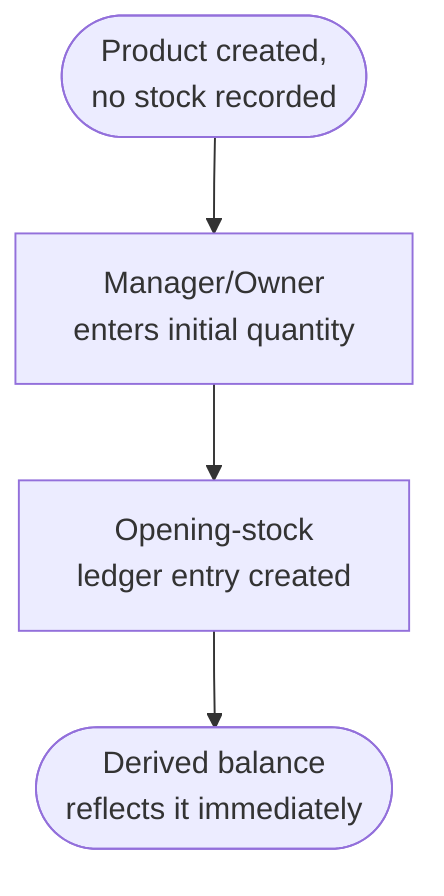
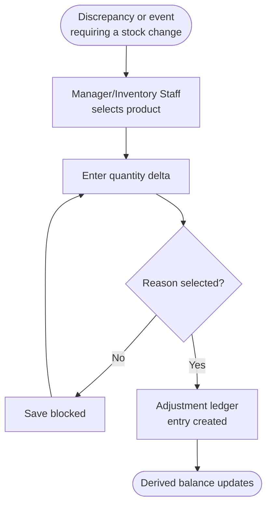
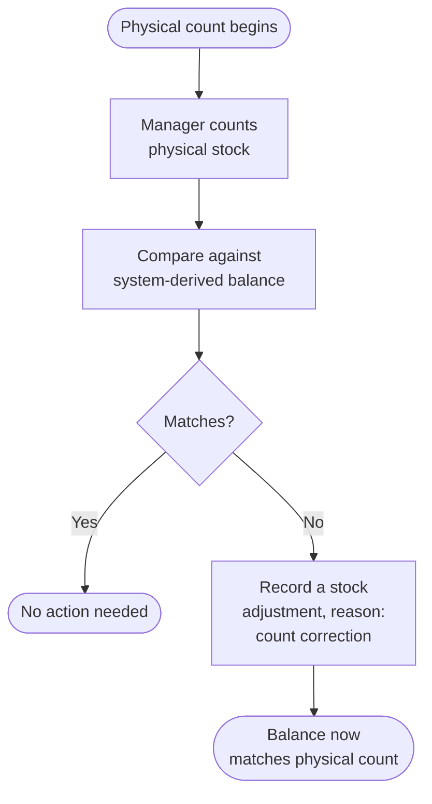

# Inventory Workflows

> **Status:** 🔵 In review
> **Phase:** 06 — Business Workflows
> **Version:** 0.1.0
> **Last updated:** 2026-07-30
> **Owner:** Business Analyst / CTO
> **Approved by:** _pending_

WF-009 through WF-011. V1 has no supplier/purchase-order module (deferred to V2, WF-D05–WF-D07), so
stock enters the system through exactly two paths: opening stock (once, per product) and stock
adjustment (ongoing, for receipts-without-a-PO, damage, expiry, loss, and count corrections alike).
"Receipt", "damage", and "expiry" from this phase's original charter are **adjustment reasons**
within WF-010, not separate workflows — there is no dedicated V1 UI for batch/expiry tracking
([scope-and-release-slices.md](../01-vision/scope-and-release-slices.md)), so an expired batch is
recorded the same way a damaged item is: an adjustment with a reason. "Transfer" (WF-D08) is V4,
deferred with multi-outlet.

---

## WF-009 — Record opening stock

| # | Actor | Action | Notes |
| --- | --- | --- | --- |
| 1 | Manager or Owner | Enter the initial quantity for a product | [FR-040](../03-functional-requirements/functional-requirements.md) |
| 2 | System | Create a single, dated opening-stock ledger entry | [DR-006](../03-functional-requirements/business-rules.md) |
| 3 | System | Derived balance reflects it without a sync round-trip | [FR-041](../03-functional-requirements/functional-requirements.md) |

| Failure path | Behaviour |
| --- | --- |
| No connection | Fully offline. |
| No permission | Cashier cannot record opening stock — [permission matrix](../05-personas/permission-matrix.md). |
| App killed mid-entry | Either the ledger entry is fully written or the product still shows no recorded stock — no partial-quantity state. |
| N/A: no stock, no printer, payment declined | Not applicable to this workflow. |

**Tap count:** ≤ 4 (select product, enter quantity, confirm). **Reversal path:** an incorrect
opening-stock entry is corrected via a stock adjustment (WF-010), never edited in place —
[DR-002](../03-functional-requirements/business-rules.md)/[DR-006](../03-functional-requirements/business-rules.md).

---

## WF-010 — Record a stock adjustment

| # | Actor | Action | Notes |
| --- | --- | --- | --- |
| 1 | Manager or Inventory Staff | Select the product and enter the quantity change | [FR-043](../03-functional-requirements/functional-requirements.md) |
| 2 | System | Require a reason from a defined list before saving | Reasons include: damage, expiry, loss/theft, count correction, other — [DR-007](../03-functional-requirements/business-rules.md) |
| 3 | System | Create a new ledger entry (never a modification of an existing one) | [DR-002](../03-functional-requirements/business-rules.md)/[FR-044](../03-functional-requirements/functional-requirements.md) |

| Failure path | Behaviour |
| --- | --- |
| No reason selected | Save is blocked client-side before it ever reaches persistence — [FR-043](../03-functional-requirements/functional-requirements.md). |
| No connection | Fully offline. |
| No permission | Cashier cannot record an adjustment — [DR-020](../03-functional-requirements/business-rules.md). |
| App killed mid-entry | Adjustment either saves in full (quantity + reason together) or not at all — a reason-less adjustment must never persist, even transiently. |
| N/A: no stock, no printer, payment declined | Not applicable. |

**Tap count:** ≤ 5, per [personas.md](../05-personas/personas.md) (Inventory Staff persona,
frequently one-handed). **Reversal path:** an incorrect adjustment is corrected by a second,
opposite adjustment (also reasoned) — never by editing or deleting the first
([DR-002](../03-functional-requirements/business-rules.md)).

---

## WF-011 — Perform a stock count and reconcile discrepancies

Not separately required at `FR` level — this is the operational procedure by which a Manager
discovers discrepancies to correct via WF-010. Included because it's a real, periodic workflow the
data model must support cleanly, not because it introduces new system behaviour.

| # | Actor | Action | Notes |
| --- | --- | --- | --- |
| 1 | Manager | Physically count stock for one or more products | Off-app activity |
| 2 | Manager | Compare against the system's derived balance | [BR-043](../02-business-requirements/business-requirements.md) / stock reports |
| 3 | Manager | For any mismatch, record an adjustment with reason "count correction" | This *is* WF-010 — no separate mechanism |

| Failure path | Behaviour |
| --- | --- |
| No connection | Fully offline — both viewing the derived balance and recording the correcting adjustment work offline. |
| No permission | Cashier can view balances but cannot record the correcting adjustment. |
| N/A: no stock, no printer, payment declined, app killed mid-flow | Covered by WF-010's own failure paths, since the correction step *is* WF-010. |

**Tap count:** not separately budgeted — this workflow's per-product correction step is WF-010's
budget (≤5); the counting itself is an off-app physical activity with no tap count to measure.
**Reversal path:** the correcting adjustment is itself reversible only by a further adjustment, per
WF-010.

## Change Log

| Version | Date | Change |
| --- | --- | --- |
| 0.1.0 | 2026-07-30 | Initial 3 inventory workflows. Clarified that receipt/damage/expiry are adjustment reasons, not separate workflows, in V1. |
