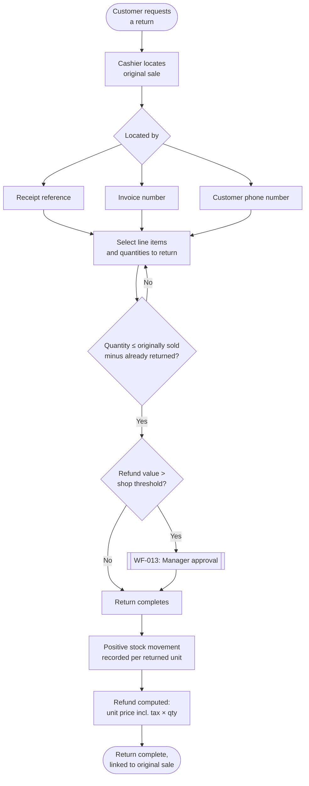
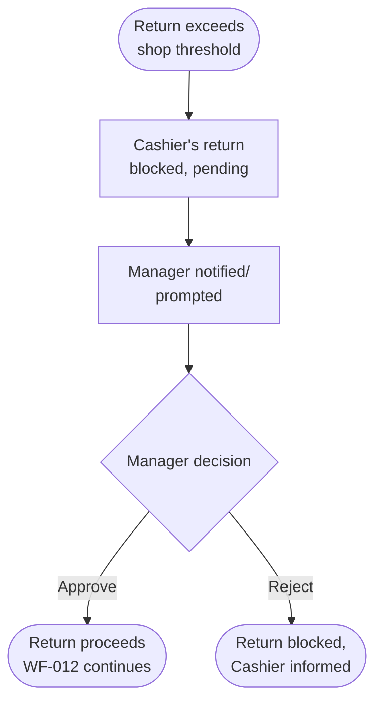

# Returns Workflows

> **Status:** 🔵 In review
> **Phase:** 06 — Business Workflows
> **Version:** 0.1.0
> **Last updated:** 2026-07-30
> **Owner:** Business Analyst / CTO
> **Approved by:** _pending_

WF-012 and WF-013. This phase's original charter also names Exchange, Store Credit, and Warranty
Claim — all deferred to V2 (WF-D01–WF-D03) per
[scope-and-release-slices.md](../01-vision/scope-and-release-slices.md); V1 covers refund-based
returns only.

---

## WF-012 — Process a return

| # | Actor | Action | Notes |
| --- | --- | --- | --- |
| 1 | Cashier | Locate the original sale by receipt, invoice number, or customer phone | [FR-062](../03-functional-requirements/functional-requirements.md) |
| 2 | Cashier | Select the line items and quantities being returned | [FR-063](../03-functional-requirements/functional-requirements.md) |
| 3 | System | Validate returned quantity ≤ (original quantity − already returned) | [DR-013](../03-functional-requirements/business-rules.md) |
| 4 | System | If refund value exceeds threshold, require Manager approval (WF-013) | [DR-015](../03-functional-requirements/business-rules.md) |
| 5 | System | Record a positive stock movement per returned unit, linked to both the return and the original sale | [FR-064](../03-functional-requirements/functional-requirements.md)/[DR-004](../03-functional-requirements/business-rules.md) |
| 6 | System | Compute the refund as original per-unit price (incl. tax) × returned quantity | [FR-065](../03-functional-requirements/functional-requirements.md)/[DR-014](../03-functional-requirements/business-rules.md) |

| Failure path | Behaviour |
| --- | --- |
| No stock ledger entry conflict | Not applicable — a return only ever adds stock back; it cannot itself cause an oversell. |
| No connection | Fully offline against locally synced sales history; if the original sale hasn't yet reached this device, the return cannot be located here — see [offline-workflows.md](offline-workflows.md). |
| No printer | The return's own receipt/confirmation follows the same print-or-share fallback as a sale ([FR-060](../03-functional-requirements/functional-requirements.md)/[FR-061](../03-functional-requirements/functional-requirements.md)). |
| No permission | Ordinary return processing is a Cashier-baseline capability ([permission matrix](../05-personas/permission-matrix.md)); only above-threshold approval is restricted (WF-013). |
| Payment declined | N/A — a refund in V1 is recorded, not processed through a live payment network. |
| App killed mid-flow | The stock movement and the refund record must commit as one unit — a return must never leave a positive stock movement recorded with no corresponding refund record, or vice versa. |

**Tap count:** target ≤ 5 (locate sale, select items, confirm) for a below-threshold return; more
for an above-threshold one, since WF-013 adds a genuine approval step that shouldn't be rushed.
**Reversal path:** a completed return is itself immutable, mirroring
[BR-030](../02-business-requirements/business-requirements.md) — a wrongly processed return is
corrected by an equivalent stock/financial adjustment, not by editing the return record, and is
itself fully auditable ([BR-009](../02-business-requirements/business-requirements.md)).

---

## WF-013 — Approve a high-value return

| # | Actor | Action | Notes |
| --- | --- | --- | --- |
| 1 | System | Detect refund value exceeds the shop-configured threshold | [DR-015](../03-functional-requirements/business-rules.md) |
| 2 | Manager | Review and approve, or reject | [FR-066](../03-functional-requirements/functional-requirements.md) |
| 3 | System | On approval, WF-012 completes; on rejection, the return is blocked | |

| Failure path | Behaviour |
| --- | --- |
| No Manager available (single-Cashier shift) | Not resolved at the workflow level — this is a real operational gap for a solo-staffed shop and is flagged forward to Phase 09 (does the approval queue persist until any Manager/Owner is next available?) rather than assumed away. |
| No connection | The approval decision itself may be made offline against the locally cached role/threshold, then re-validated server-side at sync per [DR-017](../03-functional-requirements/business-rules.md)/[DR-018](../03-functional-requirements/business-rules.md) — a rejection at sync time blocks the return in full, not partially. |
| No printer / payment declined | N/A to the approval step itself. |
| App killed mid-approval | The return remains in its pending state until a decision is recorded — no partial "half-approved" state. |

**Tap count:** ≤ 2 for the Manager's decision itself, once presented — per the Manager persona's
design implication in [personas.md](../05-personas/personas.md), the approval must interrupt
wherever the Manager already is, not require navigating to a queue.
**Reversal path:** an approval decision, once recorded, is not itself reversible — a wrongly
approved return is corrected the same way any wrongly processed return is (WF-012's reversal path).

## Change Log

| Version | Date | Change |
| --- | --- | --- |
| 0.1.0 | 2026-07-30 | Initial 2 returns workflows. Flagged an unresolved operational gap: no-Manager-available on a solo shift. |
