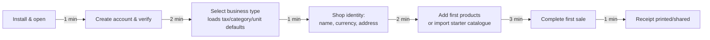
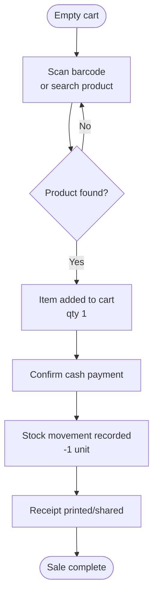
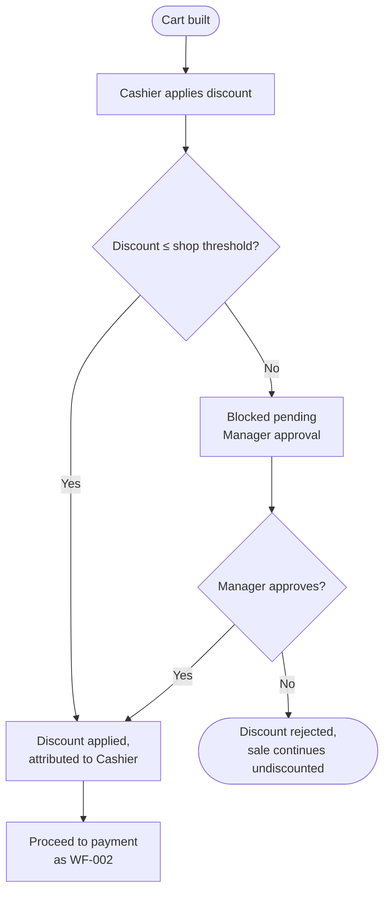
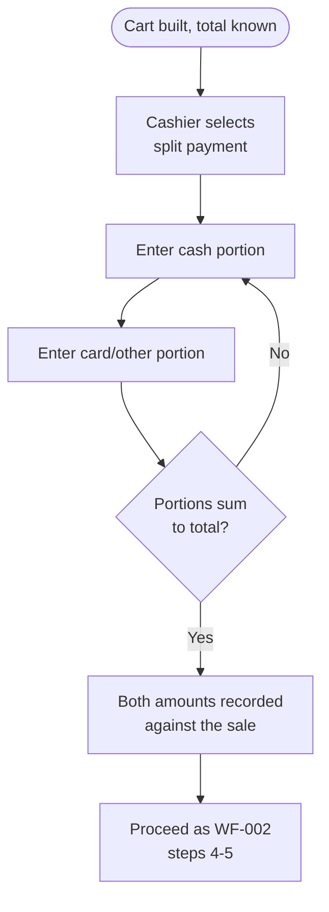
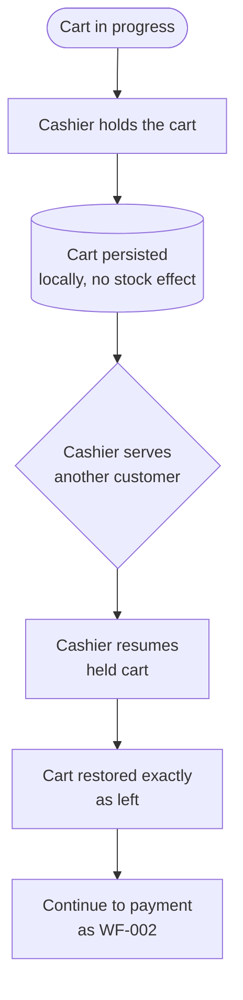
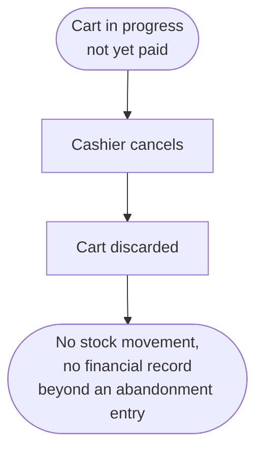
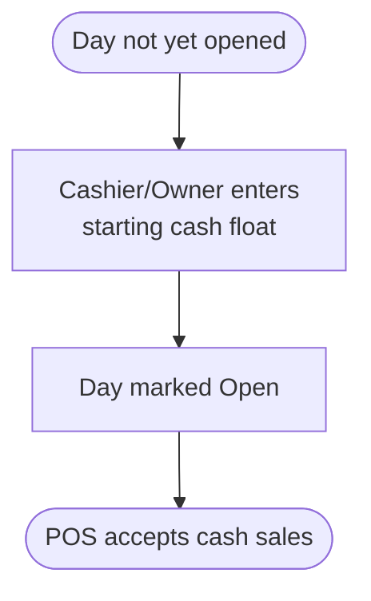
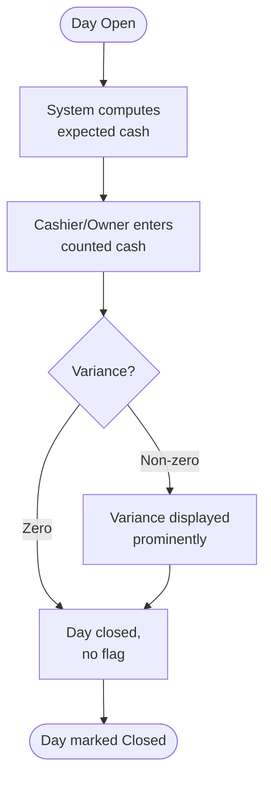

# Sales Workflows

> **Status:** 🔵 In review
> **Phase:** 06 — Business Workflows
> **Version:** 0.1.0
> **Last updated:** 2026-07-30
> **Owner:** Business Analyst / CTO
> **Approved by:** _pending_

WF-001 through WF-008. Each workflow gives a Mermaid diagram, a numbered step table, its failure
paths, its measured tap count against budget, and — where money moves — its reversal path. Offline
divergence for each is in [offline-workflows.md](offline-workflows.md), not repeated here.

---

## WF-001 — Shop onboarding

Already fully specified at requirement level as
[FR-001–FR-006](../03-functional-requirements/functional-requirements.md); reproduced here as a
workflow so this document's index is complete, not re-derived.

| Step | Actor | Action | Budget |
| --- | --- | --- | --- |
| 1 | Owner | Install and open the app | 1 min |
| 2 | Owner | Create account, verify | 2 min |
| 3 | Owner | Select business type — loads defaults | 1 min |
| 4 | Owner | Enter shop name, currency, address | 2 min |
| 5 | Owner | Add first products / import starter catalogue | 3 min |
| 6 | Owner | Complete first sale, receipt shown | 1 min |

**Failure paths:** account verification requires connectivity (FR-001 — the one step that must);
every other step is fully offline. **Budget measure:** time, not taps — [success-metrics.md](../01-vision/success-metrics.md)
tracks time-to-first-sale directly; a tap-count budget doesn't fit a multi-minute setup flow the way
it fits a single sale.

---

## WF-002 — Complete a single-item cash sale

| # | Actor | Action | Notes |
| --- | --- | --- | --- |
| 1 | Cashier | Scan barcode (or search if unscannable) | [FR-022](../03-functional-requirements/functional-requirements.md)/[FR-025](../03-functional-requirements/functional-requirements.md) |
| 2 | System | Add matching product to cart at qty 1 | [FR-022](../03-functional-requirements/functional-requirements.md) |
| 3 | Cashier | Confirm cash payment | |
| 4 | System | Record −1 stock movement | [FR-042](../03-functional-requirements/functional-requirements.md), [DR-003](../03-functional-requirements/business-rules.md) |
| 5 | System | Generate receipt (print or share) | [FR-059](../03-functional-requirements/functional-requirements.md)/[FR-060](../03-functional-requirements/functional-requirements.md) |

| Failure path | Behaviour |
| --- | --- |
| No stock recorded for this product | Sale still completes; negative balance flagged, not blocked — [BR-026](../02-business-requirements/business-requirements.md)/[DR-005](../03-functional-requirements/business-rules.md). |
| No connectivity | Entire flow is designed to require none — [FR-009](../03-functional-requirements/functional-requirements.md). |
| No printer / printer fails | Digital share fallback; sale is already complete before printing is attempted — [FR-061](../03-functional-requirements/functional-requirements.md). |
| No permission | Not applicable — completing a base sale is a Cashier-baseline permission (DR-019). |
| Payment declined | Not applicable to cash; N/A until a card/digital method exists (not in V1). |
| App killed mid-flow | Steps 2–4 must commit atomically as one local transaction — either the sale, its stock movement, and its ledger entry all persist, or none do. A kill between "payment confirmed" and "stock movement written" must not leave a sale with no corresponding stock effect; this is a binding constraint on the local transaction boundary, feeding [13-offline-sync](../13-offline-sync/README.md). |

**Tap count:** ≤ 3, measured — [BR-011](../02-business-requirements/business-requirements.md).
**Reversal path:** via the Returns workflow (WF-012) only — a completed sale is never edited
in place ([DR-002](../03-functional-requirements/business-rules.md)/[FR-012](../03-functional-requirements/functional-requirements.md)).

---

## WF-003 — Complete a sale with a discount

| # | Actor | Action | Notes |
| --- | --- | --- | --- |
| 1 | Cashier | Apply a discount to the cart or a line item | [FR-029](../03-functional-requirements/functional-requirements.md) |
| 2 | System | Check discount against shop-configured threshold | [DR-012](../03-functional-requirements/business-rules.md) |
| 3a | System | If ≤ threshold: apply immediately, attribute to Cashier | [FR-030](../03-functional-requirements/functional-requirements.md) |
| 3b | Manager | If > threshold: approve or reject before sale can complete | [DR-012](../03-functional-requirements/business-rules.md) |
| 4 | Cashier | Continue to payment (WF-002, steps 3–5) | |

| Failure path | Behaviour |
| --- | --- |
| No stock / no connection / no printer | Identical to WF-002. |
| No permission (Cashier attempts to self-approve above threshold) | Blocked at the client and re-checked server-side at sync — [DR-017](../03-functional-requirements/business-rules.md)/[DR-018](../03-functional-requirements/business-rules.md); rejected in full if the approval doesn't hold at sync time. |
| Payment declined | N/A in V1 (cash/manual only). |
| App killed mid-flow | The discount-approval state is part of the same cart/draft persistence as WF-005 (hold/resume) — an interrupted discounted cart resumes with the discount still pending or applied, never silently dropped. |

**Tap count:** ≤ 5 (2 additional actions beyond WF-002's 3 — apply discount, confirm/approve).
**Reversal path:** the sale (with its discount already applied) is only reversible via Returns
(WF-012); the discount itself is never separately "undone" post-completion.

---

## WF-004 — Complete a sale with split payment

| # | Actor | Action | Notes |
| --- | --- | --- | --- |
| 1 | Cashier | Choose split payment | [FR-028](../03-functional-requirements/functional-requirements.md) |
| 2 | Cashier | Enter the cash-method amount | |
| 3 | Cashier | Enter the second method's amount | |
| 4 | System | Validate the two amounts sum to the sale total | |
| 5 | System | Record each method's amount individually against the sale | [BR-014](../02-business-requirements/business-requirements.md) |

| Failure path | Behaviour |
| --- | --- |
| Portions don't sum to total | Sale cannot proceed to completion until corrected — a local validation, not a server round-trip. |
| No connection | Fully offline — no live card-network call exists in V1 ([FR-028](../03-functional-requirements/functional-requirements.md)); the "card" portion is a manually recorded amount, not a processed transaction. |
| No printer | Same fallback as WF-002. |
| No permission | N/A — split payment itself carries no elevated permission. |
| Payment declined | N/A — there is no live processing to decline against in V1. |
| App killed mid-flow | Same atomicity requirement as WF-002; a split sale must not be able to persist with only one of its two payment-method amounts recorded. |

**Tap count:** ≤ 6 (choose split, two amount entries, confirm, plus WF-002's base steps).
**Reversal path:** via Returns (WF-012); a returned amount from a split-payment sale must be
attributable back to the correct original method(s) — this is a requirement Phase 07's schema must
satisfy, not yet resolved at the workflow level and flagged forward.

---

## WF-005 — Hold and resume a sale

| # | Actor | Action | Notes |
| --- | --- | --- | --- |
| 1 | Cashier | Hold the in-progress cart | [FR-026](../03-functional-requirements/functional-requirements.md) |
| 2 | System | Persist line items, quantities, and any discount locally | No stock movement recorded — [FR-027](../03-functional-requirements/functional-requirements.md) |
| 3 | Cashier | Resume the held cart, possibly after an app restart | [FR-026](../03-functional-requirements/functional-requirements.md) |
| 4 | Cashier | Continue to payment | |

| Failure path | Behaviour |
| --- | --- |
| No stock effect while held | By design — nothing to fail. |
| No connection | Fully offline — held-cart persistence is entirely local. |
| No printer | N/A until payment step (WF-002 applies). |
| No permission | N/A. |
| Payment declined | N/A in V1. |
| App killed while a cart is held | Held cart must survive the restart intact — this is the entire point of [FR-026](../03-functional-requirements/functional-requirements.md); a kill is not a special case, it's the expected condition this workflow is designed against. |

**Tap count:** hold action ≤ 1 tap; resume action ≤ 1 tap. **Reversal path:** not applicable — a
held cart carries no financial or stock record to reverse.

---

## WF-006 — Cancel an in-progress sale

| # | Actor | Action | Notes |
| --- | --- | --- | --- |
| 1 | Cashier | Cancel the cart before payment confirmation | [FR-031](../03-functional-requirements/functional-requirements.md) |
| 2 | System | Discard the cart; no stock or financial record beyond an abandonment entry | [BR-016](../02-business-requirements/business-requirements.md) |

| Failure path | Behaviour |
| --- | --- |
| No stock / no connection / no printer | Not applicable — nothing has been committed yet. |
| No permission | Cancelling one's own in-progress cart carries no elevated permission (permission matrix, [05-personas](../05-personas/permission-matrix.md)). |
| Payment declined | N/A — cancellation happens before payment. |
| App killed mid-cancel | Equivalent to the cart simply never being resumed; no partial state to worry about since nothing is committed until payment confirmation. |

**Tap count:** ≤ 2 (cancel action + confirm). **Reversal path:** not applicable — nothing was
recorded to reverse.

---

## WF-007 — Open trading day

| # | Actor | Action | Notes |
| --- | --- | --- | --- |
| 1 | Cashier or Owner | Enter or confirm the starting cash float | [FR-067](../03-functional-requirements/functional-requirements.md) |
| 2 | System | Mark the trading day Open | See [state-machines.md](state-machines.md) — Trading Day |

| Failure path | Behaviour |
| --- | --- |
| No connection | Fully offline. |
| No permission | Both Cashier and Owner may open a day (permission matrix). |
| App killed mid-open | The day must not be left in an ambiguous state — either it's Open with a recorded float, or it's still NotYetOpened; no partial "Open with no float" state is valid. |

**Tap count:** ≤ 2. **Reversal path:** not applicable — opening a day moves no money by itself.

---

## WF-008 — Close trading day

| # | Actor | Action | Notes |
| --- | --- | --- | --- |
| 1 | System | Compute expected cash = float + cash sales − cash refunds | [FR-068](../03-functional-requirements/functional-requirements.md) |
| 2 | Cashier or Owner | Enter physically counted cash | [FR-069](../03-functional-requirements/functional-requirements.md) |
| 3 | System | Record both figures permanently; flag any non-zero variance | [FR-070](../03-functional-requirements/functional-requirements.md) |
| 4 | System | Mark the trading day Closed | |

| Failure path | Behaviour |
| --- | --- |
| No connection | Fully offline. |
| Non-zero variance | Not a failure — a required, visible outcome per [BR-041](../02-business-requirements/business-requirements.md); never silently accepted. |
| App killed mid-close | The day must remain Open (not partially Closed) until the counted-cash entry and variance record are committed as one unit. |
| No permission (Cashier attempting an override/reopen of an already-closed day) | Denied — Manager/Owner only, per [DR-020](../03-functional-requirements/business-rules.md) and the [permission matrix](../05-personas/permission-matrix.md). |

**Tap count:** ≤ 3 (view expected, enter counted, confirm). **Reversal path:** a closed day can be
reopened only by a Manager or Owner ([permission matrix](../05-personas/permission-matrix.md)); the
original close record is retained, not overwritten — the reopen is a new state transition, not an
edit ([state-machines.md](state-machines.md)).

---

## Scope gap: Partial / deferred payment ("credit tab")

The founding brief lists "Partial Payment" as a POS feature. Mapping it to a real workflow during
this phase surfaced that [BR-014](../02-business-requirements/business-requirements.md) only covers
**split payment across methods, fully settled at the time of sale** (WF-004) — it does not cover a
customer paying *less than the total* and owing the remainder later ("running a tab"). That's a
materially different feature: it requires a customer-receivable ledger, which is the same class of
monetary-liability feature as Store Credit and Wallet.

**Recommendation, not yet a decision:** defer true credit-sale/tab functionality to V2, grouped with
Store Credit/Wallet (WF-D02) rather than built as a standalone V1 feature — for the same reason
[scope-and-release-slices.md](../01-vision/scope-and-release-slices.md) already gives for grouping
those features together: they share failure modes (unpaid balances, reconciliation, write-offs) and
are safer designed as one unit. Flagged in [workflow-catalogue.md](workflow-catalogue.md) as WF-D04.
If the founder wants this in V1, it needs a new `BR` in Phase 02, not an ad hoc addition here.

## Change Log

| Version | Date | Change |
| --- | --- | --- |
| 0.1.0 | 2026-07-30 | Initial 8 sales/cash-drawer workflows, plus the discovered partial-payment scope gap. |
