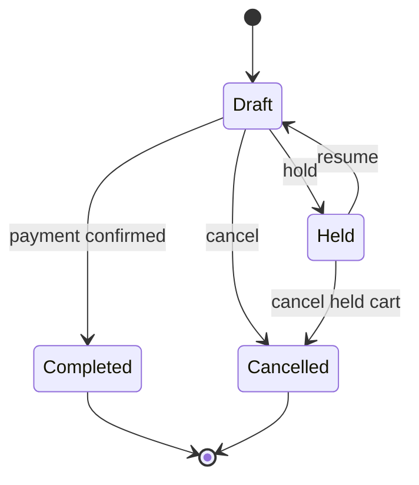
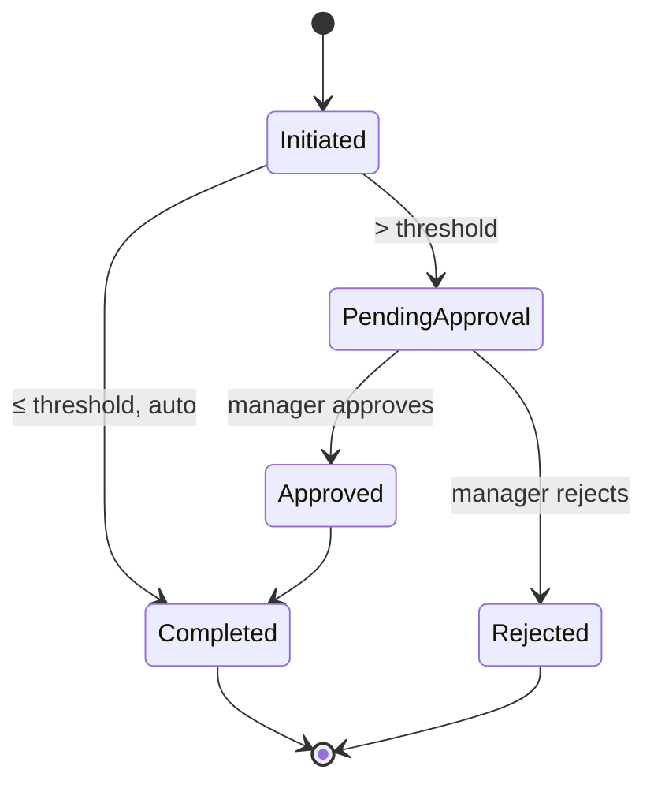
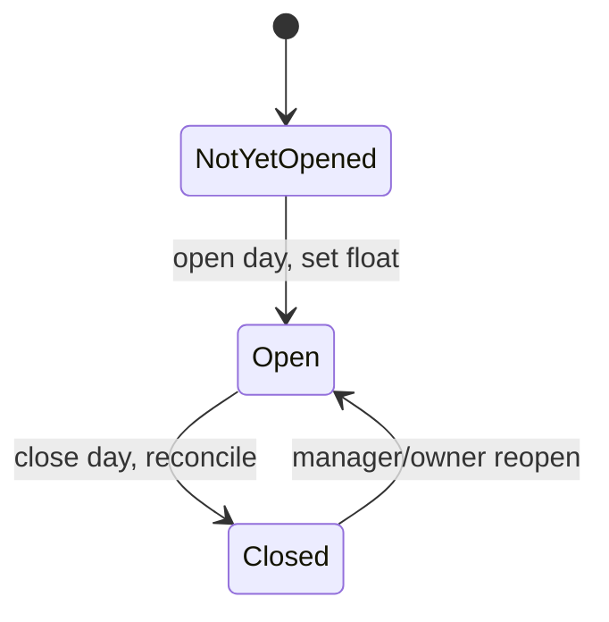
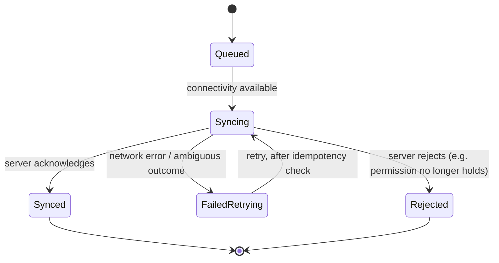

# State Machines

> **Status:** 🔵 In review
> **Phase:** 06 — Business Workflows
> **Version:** 0.1.1
> **Last updated:** 2026-08-19
> **Owner:** Business Analyst / CTO
> **Approved by:** _pending_

Four V1 state machines, each with an exhaustive transition matrix — **every state pair is either a
defined transition or explicitly forbidden with a reason**, per this phase's exit criterion.
Purchase Order and Delivery (named in the original charter) are deferred placeholders, consistent
with [procurement-workflows.md](procurement-workflows.md) — Suppliers/Purchase Orders are V2,
Delivery is V3.

**Matrix reading:** rows are the *from* state, columns are the *to* state. A cell names the
transition and its trigger, or states `✕` with the reason it's forbidden.

---

## Sale

| From ＼ To | Draft | Held | Completed | Cancelled |
| --- | --- | --- | --- | --- |
| **Draft** | ✕ no-op | hold | payment confirmed | cancel |
| **Held** | resume | ✕ no-op | ✕ must resume to Draft first — a cart can't be paid while not the active draft | cancel held cart |
| **Completed** | ✕ immutable ([DR-002](../03-functional-requirements/business-rules.md)) | ✕ immutable | ✕ no-op, and terminal | ✕ immutable |
| **Cancelled** | ✕ terminal — start a fresh sale instead | ✕ terminal | ✕ terminal | ✕ no-op |

A wrong sale is never reached backward from `Completed` — the only path to a correction is a new
`Return` record referencing this sale ([BR-030](../02-business-requirements/business-requirements.md)).

---

## Return

| From ＼ To | Initiated | PendingApproval | Approved | Completed | Rejected |
| --- | --- | --- | --- | --- | --- |
| **Initiated** | ✕ no-op | > threshold | ✕ cannot skip approval step | ≤ threshold, auto | ✕ cannot skip approval step |
| **PendingApproval** | ✕ no going back | ✕ no-op | manager approves | ✕ must be Approved first | manager rejects |
| **Approved** | ✕ decision made | ✕ decision made | ✕ no-op | proceeds to completion | ✕ decision already made, cannot reverse to rejected |
| **Completed** | ✕ immutable | ✕ immutable | ✕ immutable | ✕ no-op, terminal | ✕ immutable |
| **Rejected** | ✕ terminal — re-initiate as a new return if warranted | ✕ terminal | ✕ terminal | ✕ terminal | ✕ no-op |

---

## Trading Day

| From ＼ To | NotYetOpened | Open | Closed |
| --- | --- | --- | --- |
| **NotYetOpened** | ✕ no-op | open day (set float) | ✕ must open before it can be closed |
| **Open** | ✕ cannot revert to never-opened | ✕ no-op | close day (reconcile) |
| **Closed** | ✕ cannot revert to never-opened | reopen — Manager/Owner only ([DR-020](../03-functional-requirements/business-rules.md)) | ✕ no-op |

**Open question, not resolved here:** [offline-workflows.md — Finding 2](offline-workflows.md#finding-2--trading-day-is-a-shared-store-level-concept-and-multi-device-shops-need-a-rule)
flags that this state machine assumes one Trading Day per store; a multi-device shop may need it
scoped per-device instead, or need an explicit conflict policy for the shared case. This matrix is
correct for a single-device shop and incomplete for a multi-device one — Phase 13 must decide which.

---

## Sync Item

Represents one queued client-originated operation (a sale, a stock movement, a discount approval,
etc.) as it moves through synchronisation. This is the state machine
[13-offline-sync](../13-offline-sync/README.md) inherits as its starting point.

| From ＼ To | Queued | Syncing | Synced | FailedRetrying | Rejected |
| --- | --- | --- | --- | --- | --- |
| **Queued** | ✕ no-op | connectivity available, attempt begins | ✕ must attempt first | ✕ must attempt first | ✕ must attempt first |
| **Syncing** | ✕ cannot revert mid-attempt | ✕ no-op — exactly one in-flight attempt per item | server acknowledges | network error / ambiguous outcome | server rejects |
| **Synced** | ✕ terminal | ✕ terminal | ✕ no-op | ✕ terminal | ✕ terminal |
| **FailedRetrying** | ✕ retries go directly back to Syncing, not through Queued | retry, after checking whether the operation already landed via its idempotency key ([DR-022](../03-functional-requirements/business-rules.md)) | ✕ must go through Syncing to get an ack | ✕ no-op | ✕ must go through Syncing again |
| **Rejected** | ✕ terminal for this item | ✕ terminal | ✕ terminal | ✕ terminal | ✕ no-op — if the underlying cause is fixed, a **new** operation is queued, this one is not resurrected |

**Correction, Sprint 50 (found while writing the mobile app's first test to actually exercise an
interrupted push):** the mobile client's `SyncRepository` never writes a distinct `Syncing` row —
the row selected for the current attempt stays `Queued`/`FailedRetrying` for the entire network
call and is updated only once a real per-operation server result is known. This diagram's `Queued
→ Syncing` transition is therefore not literally implemented as a separate persisted state; it
remains accurate as the *conceptual* lifecycle (there genuinely is a period where an attempt is
in flight), just not as a distinct database write. The safety guarantee this diagram exists to
protect still holds, by a simpler real mechanism: an interrupted attempt leaves the row exactly as
it was, so it is naturally re-selected and resent on the next sync cycle — no separate "detect a
stale Syncing row" step is needed, and correctness against a duplicate resend comes from the
server's own id-keyed upsert ([idempotency.md](../13-offline-sync/idempotency.md)), not a
client-side pre-retry check. See [failure-scenarios.md §1](../13-offline-sync/failure-scenarios.md#1-the-named-scenarios)'s
own matching correction and `apps/mobile/lib/core/database/tables/outbound_queue.dart`'s docstring.

The `FailedRetrying → Syncing` retry **must** check the idempotency key against the server before
assuming the prior attempt failed — an ambiguous network outcome (request sent, response lost) is
not the same as a confirmed failure, and retrying blindly is exactly the double-submission risk
[DR-022](../03-functional-requirements/business-rules.md) exists to prevent.

---

## Deferred state machines

| Entity | Deferred to | Why |
| --- | --- | --- |
| Purchase Order | V2 | Belongs to the Procurement module — see [procurement-workflows.md](procurement-workflows.md). |
| Delivery | V3 | Belongs to Shipping & Delivery, requires the module that doesn't exist until V3. |

## Change Log

| Version | Date | Change |
| --- | --- | --- |
| 0.1.0 | 2026-07-30 | Initial 4 exhaustive state machines (Sale, Return, Trading Day, Sync Item); Purchase Order and Delivery deferred. |
| 0.1.1 | 2026-08-19 | Sprint 50 — Sync Item's `Queued → Syncing` transition corrected: not a distinct persisted state in the actual mobile implementation, found while writing the first test to exercise an interrupted push. The conceptual lifecycle and safety guarantee both still hold, via a simpler real mechanism stated in the correction. |
