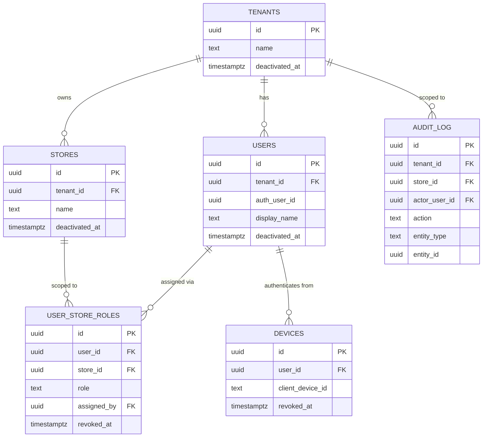
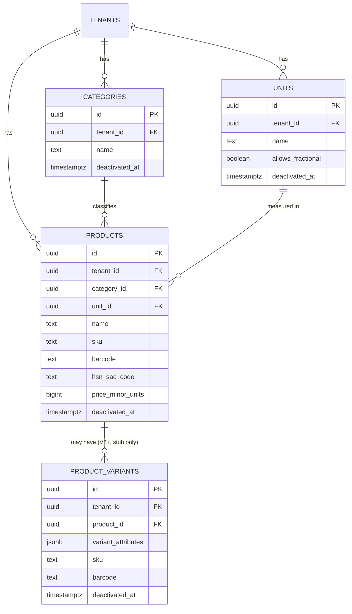
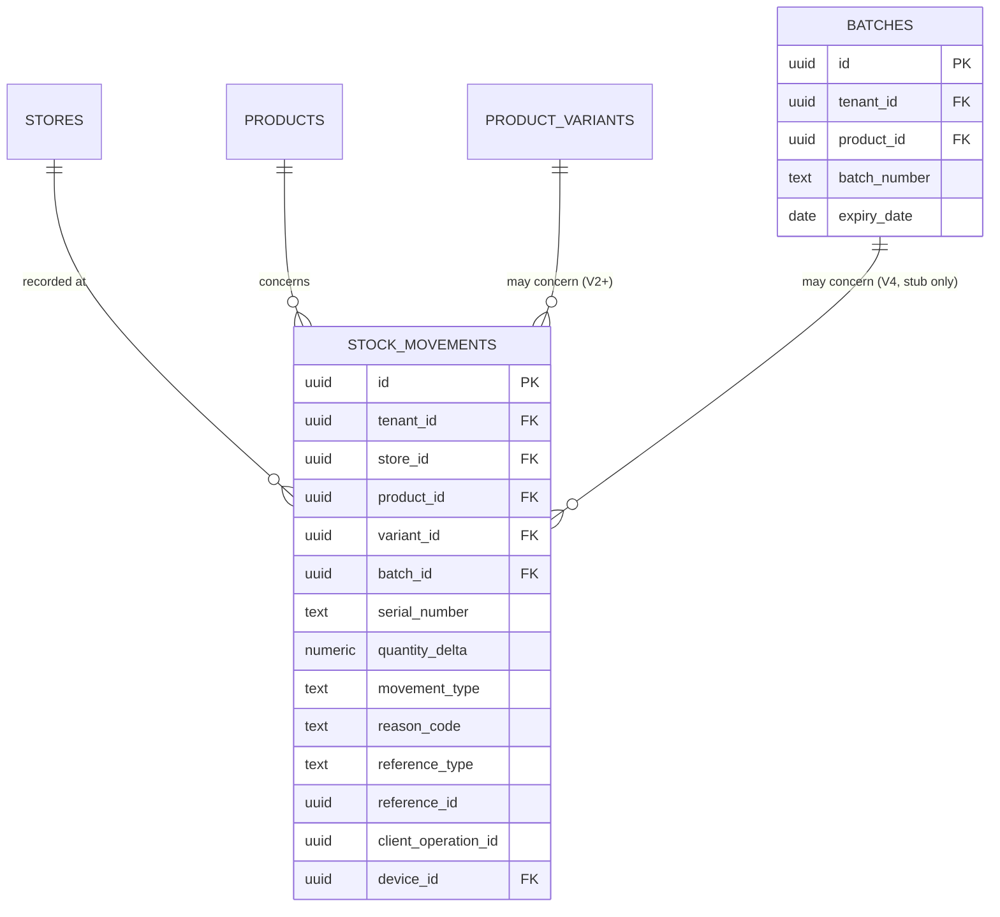
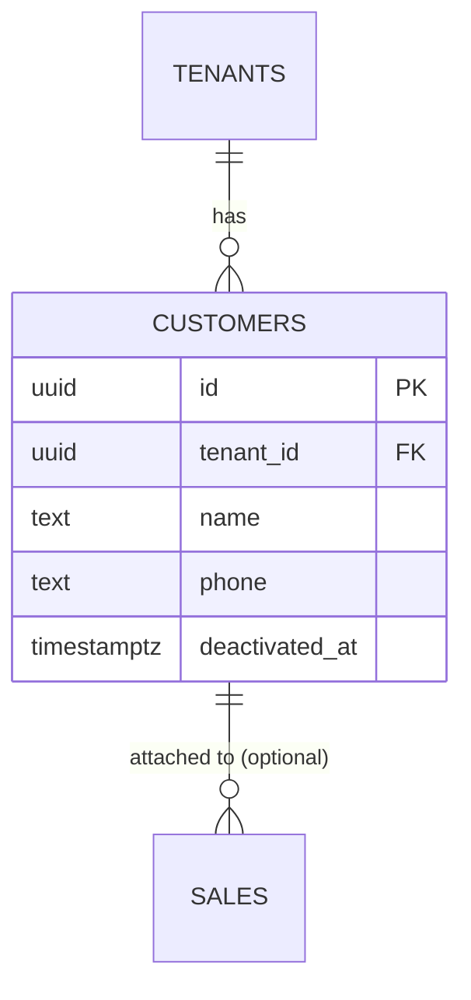
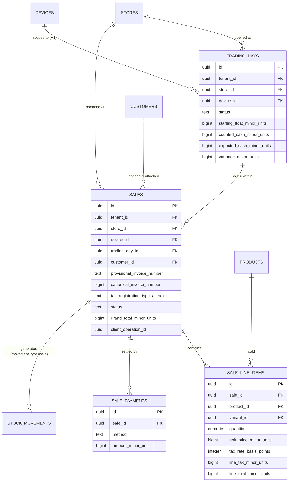
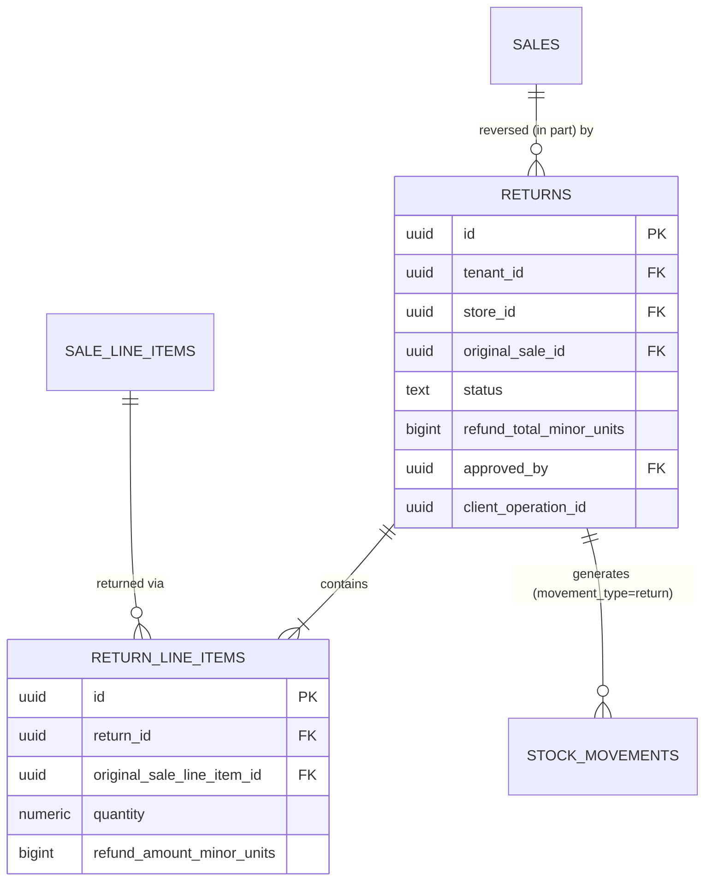

# Entity Relationship Diagrams

> **Status:** 🔵 In review
> **Phase:** 07 — Database Design
> **Version:** 0.1.0
> **Last updated:** 2026-07-30
> **Owner:** PostgreSQL Architect
> **Approved by:** _pending_

Seven bounded contexts, each a Mermaid `erDiagram`. Full column-level detail is in
[schema-server.md](schema-server.md) — these diagrams show shape and relationships, not every
column. Two stub tables (`product_variants`, `batches`) exist with no V1 write path, satisfying this
phase's exit criterion that variants/batch/expiry/serial are accommodated now.

---

## 1. Identity & Tenancy



## 2. Catalogue (tenant-scoped, not store-scoped — see [tenancy-model.md](tenancy-model.md))



## 3. Inventory (store-scoped)



**No `UPDATE`/`DELETE` grant exists on `STOCK_MOVEMENTS` for any role** —
[ADR-0005](../adr/ADR-0005-append-only-stock-ledger.md). Balance is always
`SUM(quantity_delta)`, never a stored column.

## 4. Customers (tenant-scoped)



## 5. Sales (store-scoped)



## 6. Returns (store-scoped)



## 7. Settings & Sync (tenant-scoped)

```mermaid
erDiagram
    TENANTS ||--|| SHOP_SETTINGS : configures
    TENANTS ||--o{ IDEMPOTENCY_KEYS : tracks
    TENANTS ||--o{ SYNC_REJECTIONS : records

    SHOP_SETTINGS {
        uuid tenant_id PK_FK
        text tax_mode
        text pricing_mode
        text rounding_rule
        text currency_code
        bigint discount_auto_approval_threshold_minor_units
        bigint return_auto_approval_threshold_minor_units
        jsonb printer_config
        jsonb receipt_template_config
    }
    IDEMPOTENCY_KEYS {
        uuid client_operation_id PK
        uuid tenant_id FK
        text operation_type
        uuid entity_id
        timestamptz first_seen_at
    }
    SYNC_REJECTIONS {
        uuid id PK
        uuid tenant_id FK
        uuid store_id FK
        uuid device_id FK
        text entity_type
        uuid local_entity_id
        text reason
        timestamptz resolved_at
    }
```

## Change Log

| Version | Date | Change |
| --- | --- | --- |
| 0.1.0 | 2026-07-30 | Initial 7 bounded-context ERDs, including 2 forward-accommodation stub tables. |
