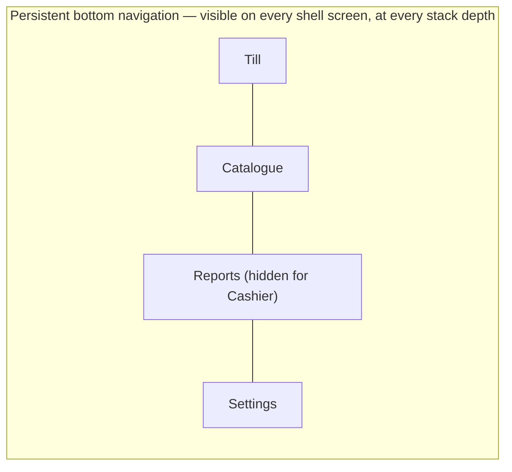

# Navigation Model

> **Status:** 🔵 In review
> **Phase:** 09 — Navigation
> **Version:** 0.1.0
> **Last updated:** 2026-07-30
> **Owner:** UI-UX Lead / Principal Flutter Engineer
> **Approved by:** _pending_

Establishes the shell structure that [route-map.md](route-map.md) and
[tap-count-audit.md](tap-count-audit.md) are built against.

---

## 1. Shell structure — persistent bottom navigation, 4 destinations

| Destination | Default landing | Who sees it |
| --- | --- | --- |
| **Till** | Yes — app launches here | Everyone (Cashier, Manager, Owner) |
| **Catalogue** | | Everyone (view); edit gated by permission within the screen |
| **Reports** | | **Manager and Owner only — this tab does not appear in a Cashier's navigation at all**, per the [permission matrix](../05-personas/permission-matrix.md)'s judgment call that shop-wide figures are business-sensitive by default |
| **Settings** | | Everyone (contents vary by role within the screen) |

**The bottom navigation bar is always visible, including on top of pushed sub-screens within a
tab.** This is a deliberate choice, not the more common "hide on detail screens" pattern — it is
what makes "the POS screen is reachable in one tap from app launch, always, from any state"
([this phase's founding rule](README.md)) true **unconditionally**, rather than true only at the
top of each tab's stack. The one exception is stated in §3.

## 2. Quick actions surfaced directly on the Till screen — not buried in a menu

Per the [Cashier persona's veto power](../05-personas/personas.md) and the queue-pressure design
implications in [device-and-context.md](../05-personas/device-and-context.md), the following are
**directly visible icons in the Till screen's app bar**, not items inside an overflow menu that
would cost an extra tap to open:

| Icon | Action | Why it's here, not in a menu |
| --- | --- | --- |
| Hold | Resume the held cart ([WF-005](../06-workflows/sales-workflows.md#wf-005--hold-and-resume-a-sale)) | Used constantly under queue pressure — an extra menu tap here directly costs against [BR-011](../02-business-requirements/business-requirements.md)'s budget. **Auto-resumes immediately if exactly one cart is held; the selection list appears only when 2 or more are held** — found necessary during the [tap-count audit](tap-count-audit.md#finding-and-fix--wf-005-resume-with-multiple-held-carts), so the common single-held-cart case stays at 1 tap. |
| Return | Start a return ([WF-012](../06-workflows/returns-workflows.md#wf-012--process-a-return)) | Frequent enough, and time-sensitive enough with a customer present, to earn a permanent slot |
| Day | Open/close the trading day ([WF-007](../06-workflows/sales-workflows.md#wf-007--open-trading-day)/[WF-008](../06-workflows/sales-workflows.md#wf-008--close-trading-day)) | Once or twice daily, but must never require hunting for it at the one moment (close of business) it's actually needed |

This is a navigation-architecture decision, not a visual one — Phase 10 owns exactly how these
icons look, not whether they exist at this level of the hierarchy.

## 3. The one exception: the active-sale full screen

While a sale is actively being built (items being scanned/added, before payment confirmation), the
bottom navigation is replaced by the full-screen cart — this is the point of that screen, not a
violation of §1's persistence rule. **Navigating away from an active cart never discards it**: per
§4, the in-progress cart is continuously persisted regardless of whether the Cashier explicitly
tapped "Hold" — so switching tabs mid-sale is safe by construction, and returning to Till resumes
exactly where the cart was left.

## 4. Resolving the mid-sale-interruption requirement

This phase's exit criterion requires the back-stack behaviour of a mid-sale interruption (incoming
call, notification, OS backgrounding, or the OS killing the process under memory pressure) to be
defined and to never lose the cart. [BR-013](../02-business-requirements/business-requirements.md)/[FR-026](../03-functional-requirements/functional-requirements.md)
already guarantee this for a cart the Cashier has **explicitly** held — this phase extends that
guarantee to cover the gap those requirements didn't address:

> **The active draft cart is continuously auto-persisted locally from the moment the first item is
> added — not only at the moment the Cashier taps "Hold."** "Hold" is a user-facing organisational
> action (setting a cart aside, possibly to start a second one, per
> [WF-005](../06-workflows/sales-workflows.md#wf-005--hold-and-resume-a-sale)) — it is not the
> trigger that makes the cart durable. Durability is unconditional from the first item onward.

**Consequence:** an incoming call, a notification tap, an app-switch, or the OS killing the
backgrounded process never loses an in-progress cart, whether or not the Cashier ever tapped
"Hold." On return to the app, the Till screen restores the exact cart state that was active when
the interruption occurred. This closes the gap between "held carts survive a restart" (already
specified) and "any cart survives any interruption" (what this exit criterion actually demands).

## 5. Nested navigation within a tab

Each tab is its own navigation stack (standard nested-navigator pattern). Pushing a detail screen
(e.g. `Catalogue → Product Detail`) keeps the bottom navigation visible per §1; the back button
pops within that tab's stack, never across tabs. Switching tabs preserves each tab's stack position
— returning to Catalogue after visiting Reports resumes wherever Catalogue was left, not its root.

## 6. Offline rendering — never an indefinite spinner

Per this phase's founding rule, no route blocks on a network call to render. Every screen has three
defined states beyond its normal populated one: **loading** (brief, local-data-only, never network-
gated), **offline-stale** (cached data shown with an explicit "last updated" indicator — never
silently presented as current), and **empty** (genuinely no data, distinct from offline-stale).
Full visual treatment of these states is [10-design-system](../10-design-system/README.md)'s job;
this phase fixes that every route *has* these states as a routing/state-management concern, not an
afterthought discovered during implementation.

## Change Log

| Version | Date | Change |
| --- | --- | --- |
| 0.1.0 | 2026-07-30 | Initial shell: 4-tab persistent bottom nav, Till app-bar quick actions, mid-sale-interruption gap closed by extending cart persistence to the draft state. |
