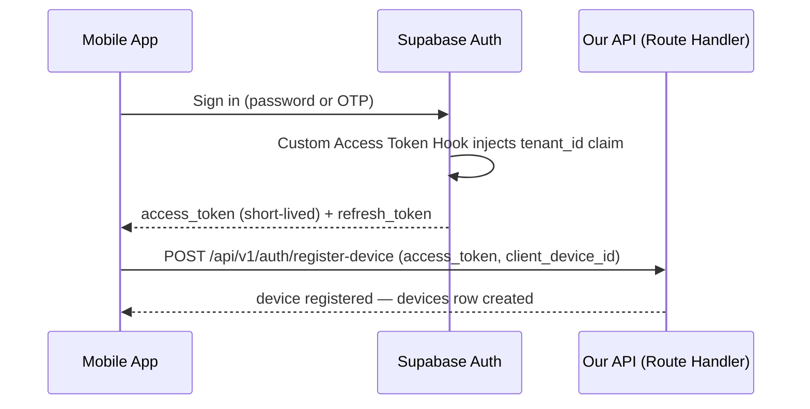

# Authentication

> **Status:** 🔵 In review
> **Phase:** 11 — API Design
> **Version:** 0.2.0
> **Last updated:** 2026-08-20
> **Owner:** Principal Next.js Engineer / CTO
> **Approved by:** _pending_

Token issuance, refresh, rotation, revocation, and device binding — the concrete mechanism behind
[system-context.md](../04-srs/system-context.md)'s TB-1 (client↔API) and TB-4 (identity) trust
boundaries, and the enforcement point for [tenancy-model.md](../07-database/tenancy-model.md)'s
`tenant_id` JWT claim.

---

## 1. Why Supabase Auth issues the token, not a second one from our API

[project-vision.md](../01-vision/project-vision.md)'s tech stack already commits to Supabase Auth
— free, open-source-compatible (GoTrue), and it already solves password/OTP handling, which this
project has no reason to reimplement. The one gap is [tenancy-model.md](../07-database/tenancy-model.md)'s
requirement that every JWT carry a `tenant_id` claim the RLS policies can read. Rather than issuing
a **second**, API-originated wrapping token (which would mean two token lifecycles to keep in sync,
and a second thing to revoke), Supabase's **Custom Access Token Auth Hook** — a Postgres function
Supabase calls at every token mint and refresh — injects `tenant_id` (resolved from the `users`
table via `auth_user_id`) directly into the Supabase-issued JWT. One token, one lifecycle, and it is
the exact token [tenancy-model.md §1](../07-database/tenancy-model.md#1-how-a-request-knows-which-tenant-it-is)
already assumes `auth.jwt()` can read. (The hook's exact configuration syntax is confirmed against
current Supabase documentation at Phase 18, per this documentation set's standing practice of not
committing to unverified tool specifics — the *architecture*, one token with an injected claim, is
the decision made now.)

## 2. Issuance flow

`POST /api/v1/auth/register-device` is the one auth-adjacent endpoint our own API owns directly —
it links the now-authenticated user to a `client_device_id`
([identifiers.md §4](../07-database/identifiers.md#4-edge-case--device-reinstallation-must-not-reuse-a-provisional-number-namespace),
generated fresh per install, never from a stable hardware ID) by creating or updating the matching
`devices` row. Every subsequent API request is rejected (see §4) until this step has completed once
per install.

## 3. Refresh and rotation

Standard Supabase Auth behaviour, used as-is rather than reimplemented: the **access token is
short-lived (target: 60 minutes)**, deliberately short because it bounds how long a revoked
device's existing token stays technically valid against Realtime (§5) where no per-request
revocation check is possible. The **refresh token rotates on every use** — each refresh invalidates
the previous refresh token, so a stolen-and-later-reused refresh token is detectable (Supabase
rejects the reuse and, per its own reuse-detection behaviour, can revoke the session family). The
mobile client refreshes proactively before expiry so a Cashier mid-sale never hits an expired-token
error at the worst possible moment — an offline-first client refreshing opportunistically whenever
connectivity is present, not only reactively on a 401.

## 4. Device binding and revocation — checked on every request, not only at token mint

A JWT remaining valid until its natural expiry is not sufficient for
[BR-005](../02-business-requirements/business-requirements.md)'s remote-revocation requirement (a
lost or stolen device must stop working promptly, not merely "within an hour"). Every authenticated
API request therefore performs a lightweight lookup — `devices.revoked_at IS NULL` for the
`client_device_id` presented — **in addition to** JWT signature/expiry verification. A revoked
device's next API call is rejected with `DEVICE_REVOKED` (see
[error-catalogue.md](error-catalogue.md)) regardless of how much time is left on its access token.

**Built, Sprint 55 — the exact "presented" mechanism, left unspecified here, is now decided:** a
custom `X-Device-Id` request header, sent alongside `Authorization: Bearer <token>` on every API
call the mobile client makes. This is the first custom header this codebase has ever needed — the
alternative (a Custom Access Token Hook claim, matching how `tenant_id` is injected) was considered
and rejected: `client_device_id` isn't known at token-mint time for a *newly registered* device on
its very first sign-in (register-device is itself the call that creates the row, necessarily after
the token already exists), so it can't be embedded as a JWT claim the same way `tenant_id` is.
`core/auth/session.ts`'s `requireSession` reads this header and rejects with `DEVICE_REVOKED` if
it's missing entirely, not just if the device it names is revoked — a missing header and a genuine
revocation are treated identically, since the mobile client's own response to either is the same
(force a local sign-out, §5).

**This check is the API path's specific defence; it does not extend to Realtime.** Per
[system-context.md](../04-srs/system-context.md)'s standing TB-2 finding (Realtime relies on RLS
alone, with no API-layer backup), a revoked device's direct Realtime subscription remains
technically authorised by RLS until its JWT naturally expires — which is exactly why the access
token lifetime in §3 is kept short. This is a known, accepted, and previously documented gap, not a
new one introduced here; this document is where the mitigation (short token TTL bounding the
exposure window) is made concrete.

## 5. Revocation flow

| Actor | Action | Effect |
| --- | --- | --- |
| Owner (only — per [permission-matrix.md](../05-personas/permission-matrix.md)) | Views device list, selects "Revoke" on a device | `PATCH /api/v1/devices/{id}/revoke` sets `devices.revoked_at`/`revoked_by` |
| Revoked device | Next API request | Rejected, `DEVICE_REVOKED`, client forces a local sign-out and clears cached session — **but never deletes the unsynced local sales queue**, per [BR risk R-09](../01-vision/risks-constraints-assumptions.md) — a revoked device is still the only copy of its own not-yet-synced sales until a Manager/Owner recovers the data through a supported path (Phase 13 concern, flagged here as a hard constraint on what revocation is allowed to destroy) |
| Revoked device | Next Realtime message | Still received until the device's current access token expires (§4) |

## 6. What this document does not decide

Password policy specifics, OTP delivery channel (SMS provider — a paid-service question deferred to
[OD-02](../01-vision/open-decisions.md)'s hosting-cost decisions), and session-list UI are Phase 18
implementation details or Phase 10 design details, not architecture — this document fixes the token
model and the revocation guarantee, which are the parts a later phase cannot safely improvise.

## Change Log

| Version | Date | Change |
| --- | --- | --- |
| 0.1.0 | 2026-07-30 | Initial token model: Custom Access Token Hook for tenant_id injection, refresh rotation, per-request device revocation check, explicit TB-2 Realtime exposure-window acknowledgement. |
| 0.2.0 | 2026-08-20 | Sprint 55 — device registration/revocation built (`POST /auth/register-device`, `GET /devices`, `PATCH /devices/{id}/revoke`, `requireSession`'s per-request check), closing the OWASP review's other flagged authorisation-model.md §2 gap. §4's previously-unspecified "how `client_device_id` is presented" resolved as a new `X-Device-Id` header — a Custom Access Token Hook claim was considered and rejected, since a newly-registered device's id isn't known at token-mint time. |
