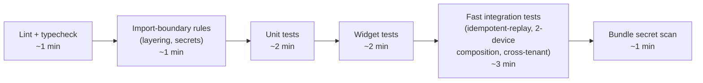

# CI Pipeline

> **Status:** 🔵 In review
> **Phase:** 14 — Testing Strategy
> **Version:** 0.1.0
> **Last updated:** 2026-07-31
> **Owner:** QA Lead / DevOps
> **Approved by:** _pending_

Gates, ordering, timing, and what blocks a merge — assembling every CI-enforced check named across
Phases 08, 11, 12, and 13 into one concrete pipeline, against the ≤10-minute pipeline-duration
target already fixed in [success-metrics.md](../01-vision/success-metrics.md).

---

## 1. Why timing is a first-class design constraint here, not an afterthought

GitHub Actions (free tier, per this project's free/open-source-first constraint) grants a bounded
monthly minute allowance on private repositories — every stage below is placed deliberately to stay
inside both the ≤10-minute **per-PR** target and a sustainable **monthly total**, given this project
will run this pipeline on every push, not just once. This is why the split between PR-gated and
nightly/release-gated checks (already previewed in
[offline-test-suite.md §3](offline-test-suite.md#3-ci-placement) and
[test-strategy.md](test-strategy.md)) is a budget decision as much as a correctness one.

## 2. Pipeline stages — every pull request

| Stage | Content | Blocks merge on failure? |
| --- | --- | --- |
| Lint + typecheck | ESLint/TypeScript (backend), Dart analyzer (mobile) | Yes |
| Import-boundary rules | [layering-rules.md](../08-folder-structure/layering-rules.md)'s dependency-cruiser config, plus [secrets-management.md §3](../12-security/secrets-management.md#3-the-build-time-check--the-exit-criterions-actual-mechanism)'s client/server boundary rule | Yes |
| Unit tests | [test-strategy.md §1](test-strategy.md#1-business-rule-traceability--the-exit-criterion-made-checkable)'s full 26-rule DR traceability suite, plus every other unit test | Yes |
| Widget tests | [10-design-system](../10-design-system/README.md)'s per-component state matrix | Yes |
| Fast integration tests | [offline-test-suite.md §3](offline-test-suite.md#3-ci-placement)'s PR-gated subset (idempotent-replay, 2-device composition) **and** [security-test-plan.md §1](security-test-plan.md#1-cross-tenant-isolation)'s 22-table cross-tenant suite — both run on **every** PR regardless of which files changed, since a tenant-isolation regression is too severe to gate only on a heuristic "did this PR look relevant" filter | Yes |
| Bundle secret scan | [secrets-management.md §3](../12-security/secrets-management.md#3-the-build-time-check--the-exit-criterions-actual-mechanism)'s content scan of the built client bundle | Yes |

**Target: ≤10 minutes total**, per [success-metrics.md](../01-vision/success-metrics.md) — stages
run in parallel where they have no dependency on one another (widget tests and fast integration
tests do not depend on each other's outcome, only on the earlier lint/unit gates having passed),
not strictly sequentially as the diagram's left-to-right layout might suggest.

## 3. Nightly pipeline

| Stage | Content |
| --- | --- |
| N-device fuzzed composition (100 runs) | [test-plan.md §2](../13-offline-sync/test-plan.md#2-concurrent-composition-tests) |
| Full failure-scenario suite | All 10 scenarios in [failure-scenarios.md §1](../13-offline-sync/failure-scenarios.md#1-the-named-scenarios), including the slower-to-set-up ones deferred from the PR gate |
| Property-based money/stock tests, extended run | [test-strategy.md §4](test-strategy.md#4-property-based-testing--money-and-stock-not-only-worked-examples), run with a larger generated-input budget than the PR-gated quick pass |
| Full dependency audit | Open-source dependency vulnerability scan (a free GitHub-native feature — Dependabot alerts — rather than a separate paid service) |

A nightly failure does not block same-day merges already in flight, but **does block the next
release candidate from being cut** until resolved — treated with urgency, not ignored until
convenient.

## 4. Release-candidate pipeline (additional, on top of nightly)

| Stage | Content |
| --- | --- |
| API load test at 10× expected peak | [performance-test-plan.md §3](performance-test-plan.md#3-server-side-budgets), closing [rate-limiting.md §3](../11-api/rate-limiting.md#3-connection-pooling--the-r-07-mitigation-load-tested-before-ga)'s forward-tracked item |
| Client performance budgets on physical reference device | [performance-test-plan.md §1](performance-test-plan.md#1-client-side-budgets--asserted-on-the-reference-device) — the one stage that cannot run on a standard CI runner and requires a connected physical device or device farm |
| Manual test scripts | [manual-test-scripts.md](manual-test-scripts.md)'s three scripted suites, executed and evidenced by a human, recorded per [release-checklist.md](release-checklist.md) |

## 5. What blocks a merge vs. what blocks a release — stated as one rule

**Merge-blocking:** anything that can be checked automatically in under the PR budget, without
special hardware. **Release-blocking only:** anything requiring physical hardware, extended
randomised runs, or human execution. Nothing is optional in either category — the distinction is
purely about *when* a failure stops work, never about *whether* a check matters.

## Change Log

| Version | Date | Change |
| --- | --- | --- |
| 0.1.0 | 2026-07-31 | Full pipeline specified across 3 tiers (PR/nightly/release-candidate), sized against the ≤10-minute PR budget and GitHub Actions' free-tier minute constraint; merge-vs-release-blocking distinction made explicit. |
