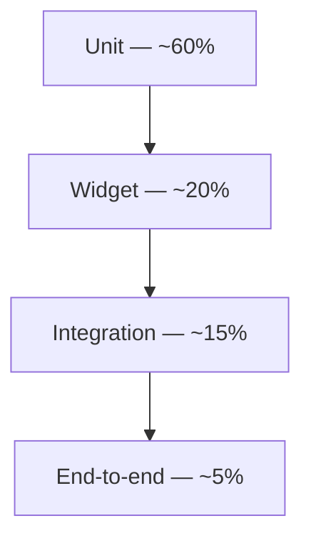

# Test Pyramid

> **Status:** 🔵 In review
> **Phase:** 14 — Testing Strategy
> **Version:** 0.1.0
> **Last updated:** 2026-07-31
> **Owner:** QA Lead / CTO
> **Approved by:** _pending_

Proportions and rationale for the four levels [test-strategy.md §2](test-strategy.md#2-levels-and-ownership)
named — this document is where the *shape* of the pyramid is justified, specifically against this
project's own risk profile rather than a generic industry ratio.

---

## 1. Target proportions

| Level | Target share of total test count | Why this share, specifically for this product |
| --- | --- | --- |
| Unit | ~60% | Every one of Phase 03's 26 business rules ([test-strategy.md §1](test-strategy.md#1-business-rule-traceability--the-exit-criterion-made-checkable)) is a pure function over plain values — money, tax, stock, permission logic — and is fastest and cheapest to test exhaustively (including failure branches, per this phase's rule) at this level. This is the highest-value layer for a financial application specifically, not a default ratio copied from elsewhere. |
| Widget | ~20% | [10-design-system](../10-design-system/README.md)'s state matrix (default/pressed/disabled/loading/error, per component) is large and mechanical enough to be worth automating, but doesn't need real devices or a real backend to verify. |
| Integration | ~15% | Repository↔Prisma, Drift↔local SQLite, and Sync Engine↔test-API contract tests — fewer in number, each more expensive to run (real database, real network), reserved for the boundaries where a unit test's fakes could hide a real integration bug (e.g. an actual Prisma query missing a `tenant_id` filter, which [tenant-isolation.md](../12-security/tenant-isolation.md)'s own suite lives at exactly this level). |
| End-to-end | ~5% | The most expensive and slowest level (a real or emulated device against a staging API) — reserved for the handful of true end-to-end workflows ([WF-001](../06-workflows/sales-workflows.md) through [WF-013](../06-workflows/returns-workflows.md)) where the *composition* of every layer matters, not any one layer's correctness in isolation. |

## 2. Why this is inverted relative to how the founding brief's feature list reads

A feature list (POS, inventory, returns, reports...) reads as a list of *screens*, which might
suggest weighting toward end-to-end tests of each screen. This pyramid deliberately does not follow
that instinct: a screen-level e2e test that asserts "the total shown is correct" is a much weaker,
slower, flakier proxy for correctness than a unit test asserting the tax-and-discount calculation
itself is correct across the input space (per [test-strategy.md §4](test-strategy.md#4-property-based-testing--money-and-stock-not-only-worked-examples)'s
property-based tests) — the e2e test would only ever catch what the unit test already caught, more
slowly and with more incidental failure modes (network flakiness, emulator timing) unrelated to the
actual business logic being verified.

## 3. Where Phase 12 and Phase 13's suites sit

[tenant-isolation.md](../12-security/tenant-isolation.md)'s cross-tenant suite and
[test-plan.md](../13-offline-sync/test-plan.md)'s adversarial sync suite are **integration-level**
tests by this pyramid's definition (real database/real fault-injecting proxy, no UI involved) — they
are not counted toward the ~5% e2e budget, and they are not optional or "nice to have" within the
~15% integration share; per [ci-pipeline.md](ci-pipeline.md), both are release gates regardless of
where they sit proportionally.

## Change Log

| Version | Date | Change |
| --- | --- | --- |
| 0.1.0 | 2026-07-31 | Pyramid proportions (60/20/15/5) justified against this project's specific risk profile; explicit rationale for why a screen-feature-list instinct toward e2e-heavy testing is rejected; Phase 12/13 suites located within the pyramid. |
