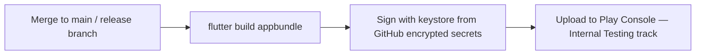

# CD Workflows

> **Status:** 🔵 In review
> **Phase:** 15 — GitHub Project
> **Version:** 0.5.0
> **Last updated:** 2026-08-21
> **Owner:** DevOps Engineer / CTO
> **Approved by:** _pending_

Backend deployment, Android build and distribution, versioning — and, per this phase's exit
criterion, a rollback procedure that exists and is rehearsed before it's needed.

---

## 1. Backend deployment — Vercel, one merge

Per this phase's rule ("deployments are boring: one command or one merge"): merging to `main`
triggers Vercel's own native GitHub integration (free, no custom workflow needed) to build and
deploy `apps/web` automatically. Every pull request additionally gets its own **preview deployment**
(also a free Vercel feature) — meaning a reviewer, or the solo-review compensating control in
[repository-setup.md §3](repository-setup.md#3-the-honest-gap--solo-founder-review-stated-plainly-rather-than-worked-around),
can exercise the actual change against a live preview URL, not only read the diff.

**Corrected 2026-08-20 (found while merging Sprint 55, not by inspection):** this claim is true for
schema *migrations* (`prisma migrate deploy`, run automatically as part of Vercel's own build step)
but was never true for Row-Level Security. RLS policies live in `supabase/sql/*.sql`, deliberately
kept outside Prisma's migration flow (`tenancy-model.md §2`) — CI only ever applies these files
against the ephemeral `fast-integration` test container (`integration-tests/setup/apply-sql.mjs`),
**never** against the real project. Every numbered file from `001_` through `019_` has, in practice,
required a human to run it against the real Supabase SQL editor by hand after merging — this exactly
matches the "a step a human has to remember to run is a step that eventually gets forgotten" risk
this section's own rule warns against, previously true of this path without this section ever
admitting it. **No automated fix built this pass** — a genuine CD mechanism (a Supabase CLI step in
the Vercel build, or a GitHub Action running `apply-sql.mjs`-equivalent against the real
`DATABASE_URL` on merge) is real, separately-scoped follow-up work, named here rather than silently
left unfixed a second time. Until then: **any PR that adds a new `supabase/sql/*.sql` file is not
actually deployed until someone manually applies that file to the real project** — this is the one
manual step this document should have named all along.

**Corrected further, Sprint 59 — the "confirmed by implementation-log.md's own repeated 'applied
live' entries" clause above was itself imprecise, checked file-by-file rather than trusted.** That
phrase appears explicitly only for `003`–`007`, `012`, and `015`. For `010`/`011`/`013`/`014`/`016`
there's reasonable circumstantial evidence (each introducing sprint's own demo ran against real
production Supabase with a passing cross-tenant check for that table) but no file-specific
confirming sentence. For **`017`/`018` (`sale_line_items`/`sale_payments`/`return_line_items`,
Sprint 40) and `019` (`devices`, Sprint 55) there is no confirmation anywhere on record that these
three files were ever actually applied to the real production database** — Sprint 40's own text
distinguishes local verification from "the shared production Supabase project" and never claims the
latter for these two files; Sprint 55's own demo script lists a real-Supabase smoke test as "not
performed this sprint." See `owasp-checklist.md`'s finding #1 for the security consequence — this
isn't merely a process-hygiene gap, it may mean specific tables have had no live RLS protection at
all, a distinct and more severe possibility than "RLS present but owner-exempt."

## 2. Android build, signing, and distribution

**Corrected, Sprint 58 (found while checking why Android release signing had never been threaded
into `release-checklist.md`, not by inspecting this section itself first):** everything below is
the **designed** pipeline, not a built one — the same gap Sprint 55/PR #79 already found and named
for §1's RLS-SQL deployment path, now found here too. `release-candidate.yml` does not exist in
`.github/workflows/` (only `pr.yml` and `nightly.yml` do); no GitHub encrypted secret for a signing
keystore has ever been created; nothing in this repository has ever built, signed, or uploaded an
app bundle to Google Play Console, Internal Testing or otherwise. Every Android build produced by
this project so far (Sprints 10, 16, 48, 54) has been a manual, local `flutter build apk` command,
signed with the default debug keystore (`apps/mobile/android/app/build.gradle.kts`'s own `// TODO:
Add your own signing config for the release build` comment, per `owasp-checklist.md`'s M8 finding),
re-served over a local network file share for the founder's own device — workable for founder-only
testing, not a path any real pilot shop could use. The diagram and table below remain the intended
design (`ci-workflows.md §3` already names `release-candidate.yml`'s trigger shape); building it for
real is real, separately-scoped follow-up work, named here rather than assumed done because a
design doc describes it in the present tense.

**Narrowed, Sprint 61 — this section's own "not a path any real pilot shop could use" claim above
was itself never checked against [pilot-plan.md](../16-milestones/pilot-plan.md)'s actual pilot
shape, and doesn't hold once it is.** The distribution mechanism below (Play Console's Internal
Testing track) was designed at Phase 15, before Phase 16's `pilot-plan.md` committed the first
pilot to something much smaller: 2–3 shops, founder-known, with the founder physically present for
the day-one visit (§2) and a deliberately minimal support model that names avoiding "premature
generality" as its own explicit standard (§3, for feedback tooling — the identical reasoning
applies here). Setting up Play Console API access, a service account, and an automated release
pipeline for 2–3 founder-visited shops is exactly that kind of premature generality. **What the
first pilot actually needs is narrower and already within reach: a real, non-debug signing
keystore**, so `flutter build apk --release` produces a properly-signed build — then a direct
sideload install during the founder's own day-one visit, the identical mechanism already proven
reliable across every real-device install this project has done (Sprints 10, 16, 48, 54). Play
Console distribution remains real, valuable work for scaling *past* founder-personal visits — that
work is commercial-launch scope (`release-checklist.md §3`), not a pilot blocker. See
`release-checklist.md`'s own corrected rows for the resulting split.

| Step | Detail |
| --- | --- |
| Build | `flutter build appbundle --release`, run inside `release-candidate.yml` ([ci-workflows.md §3](ci-workflows.md#3-release-candidateyml--manually-triggered-or-on-a-release-branch-push)) |
| Signing | The upload keystore (`.jks`) is stored **only** as a GitHub encrypted repository secret (base64-encoded), never committed — per this phase's own exit criterion. The keystore password and key alias are separate secrets. Signing happens entirely inside the GitHub Actions runner's ephemeral environment; the keystore file is written to disk only for the duration of the signing step and the runner is destroyed immediately after. |
| Distribution | **Internal Testing track** on Google Play Console for pilot/internal builds — free, no separate distribution service needed. Public production track promotion is a manual, deliberate action gated by the [release-checklist.md](../14-testing/release-checklist.md), never automatic on every merge. |

## 3. Versioning

`pubspec.yaml`'s `version: X.Y.Z+B` — semantic version (`X.Y.Z`, matching the milestone the release
belongs to, per [labels-and-milestones.md §2](labels-and-milestones.md#2-milestone-structure--the-naming-convention-not-the-dates))
plus a monotonically increasing build number `B`, auto-incremented by the release workflow itself
(reading the last published build number from Play Console's API, not from a file that could drift
out of sync with what's actually published) — this is the one piece of "versioning" that must never
be manually edited, since a human-edited build number is exactly the kind of manual step this
phase's rules argue against.

## 4. Rollback procedure

| Component | Rollback mechanism |
| --- | --- |
| Backend (Vercel) | Vercel's own instant rollback to any previous deployment — a one-click/one-CLI-command action, already built into the platform, no custom tooling needed |
| Database migration | Per [definition-of-done.md](../00-governance/definition-of-done.md)'s own requirement, every migration is reversible or its irreversibility is explicitly justified — rollback applies the migration's own `down` script; an irreversible migration's justification doc states the alternative recovery path (e.g. restore from backup, per [incident-response.md §4](../12-security/incident-response.md#4-recovery)) |
| Android | **Cannot be rolled back in the same sense** — an app already installed on a device cannot be silently downgraded. The mitigation is [api-principles.md §1](../11-api/api-principles.md#1-versioning)'s own standing guarantee: old app versions keep working against the still-live `v1` API contract, so a bad mobile release is contained by halting its further rollout (Play Console's staged-rollout percentage, set to 0%) rather than by reversing what's already installed |

## 5. The rehearsal — an honest gap, not skipped

Per this phase's exit criterion, the rollback procedure must be **rehearsed once, before it is
needed** — this cannot be satisfied by writing the procedure down, only by actually running it
against a real (staging) deployment. **This is a Phase 18 action, tracked here explicitly rather
than assumed complete**, matching this documentation set's standing practice for every other
execution-only gap (the 10× load test, the physical-device performance budgets, the adversarial
sync suite's first real CI run). The specific rehearsal: deploy a deliberately broken staging build,
execute the Vercel rollback, and confirm the previous version serves traffic within a stated target
(a few minutes) — done once, documented with its actual timing, before this procedure is trusted
during a real incident.

## Change Log

| Version | Date | Change |
| --- | --- | --- |
| 0.1.0 | 2026-07-31 | Vercel git-push deployment; Android signing via GitHub encrypted secrets, never committed; auto-incremented build numbering; rollback mechanism per component; rehearsal flagged honestly as a pending Phase 18 action. |
| 0.2.0 | 2026-08-20 | Corrected §1's "no manual deployment step exists" claim, found while merging Sprint 55's `019_rls_devices.sql`: true for Prisma migrations, never true for RLS — `supabase/sql/*.sql` has always needed a human to apply it to the real project by hand, confirmed by `implementation-log.md`'s own repeated "applied live" history for every prior numbered file. Named as a real, unfixed gap (a genuine CD mechanism for this is separately-scoped future work), not silently corrected away. |
| 0.3.0 | 2026-08-21 | Sprint 58: corrected §2 the same way §1 was corrected last sprint — the entire Android build→sign→upload pipeline described here (`release-candidate.yml`) was never actually built; no such workflow exists, no signing-keystore secret has ever been created, and no app bundle has ever reached Google Play Console. Every real Android build produced by this project has been a manual, local, debug-signed `flutter build apk` command. Threaded into `release-checklist.md` for the first time in the same pass — this gap had been named in `owasp-checklist.md` since Sprint 43 but never carried into the actual release gate. |
| 0.4.0 | 2026-08-21 | Sprint 59: §1's own "confirmed by implementation-log.md's own repeated 'applied live' entries" clause was itself imprecise, checked file-by-file rather than trusted. That phrase appears explicitly only for 7 of the 18 RLS files (`003`–`007`, `012`, `015`); for `017`/`018`/`019` there is no confirmation on record they were ever applied to the real production database at all — a real, previously-invisible possibility that specific tables (including Sprint 40's own "most significant" RLS fix) may have no live RLS protection whatsoever, distinct from and more severe than `owasp-checklist.md`'s existing FORCE/role finding. |
| 0.5.0 | 2026-08-21 | Sprint 61: narrowed §2's own Sprint 58 correction — its "not a path any real pilot shop could use" claim was never checked against `pilot-plan.md`'s actual pilot shape (2–3 founder-visited shops, deliberately minimal). Play Console Internal Testing is premature generality for that pilot, the same reasoning `pilot-plan.md §3` already applies to feedback tooling; what the first pilot actually needs is a real signing keystore plus direct sideload, the mechanism already proven across every real-device install this project has done. Play Console distribution moves to commercial-launch scope. |
