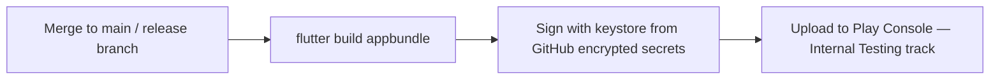

# CD Workflows

> **Status:** 🔵 In review
> **Phase:** 15 — GitHub Project
> **Version:** 0.1.0
> **Last updated:** 2026-07-31
> **Owner:** DevOps Engineer / CTO
> **Approved by:** _pending_

Backend deployment, Android build and distribution, versioning — and, per this phase's exit
criterion, a rollback procedure that exists and is rehearsed before it's needed.

---

## 1. Backend deployment — Vercel, one merge

Per this phase's rule ("deployments are boring: one command or one merge"): merging to `main`
triggers Vercel's own native GitHub integration (free, no custom workflow needed) to build and
deploy `apps/web` automatically. Every pull request additionally gets its own **preview deployment**
(also a free Vercel feature) — meaning a reviewer, or the solo-review compensating control in
[repository-setup.md §3](repository-setup.md#3-the-honest-gap--solo-founder-review-stated-plainly-rather-than-worked-around),
can exercise the actual change against a live preview URL, not only read the diff.

**No manual deployment step exists anywhere in this path** — per this phase's rule, a step a human
has to remember to run is a step that eventually gets forgotten under time pressure, exactly the
condition a release is most likely to happen under.

## 2. Android build, signing, and distribution

| Step | Detail |
| --- | --- |
| Build | `flutter build appbundle --release`, run inside `release-candidate.yml` ([ci-workflows.md §3](ci-workflows.md#3-release-candidateyml--manually-triggered-or-on-a-release-branch-push)) |
| Signing | The upload keystore (`.jks`) is stored **only** as a GitHub encrypted repository secret (base64-encoded), never committed — per this phase's own exit criterion. The keystore password and key alias are separate secrets. Signing happens entirely inside the GitHub Actions runner's ephemeral environment; the keystore file is written to disk only for the duration of the signing step and the runner is destroyed immediately after. |
| Distribution | **Internal Testing track** on Google Play Console for pilot/internal builds — free, no separate distribution service needed. Public production track promotion is a manual, deliberate action gated by the [release-checklist.md](../14-testing/release-checklist.md), never automatic on every merge. |

## 3. Versioning

`pubspec.yaml`'s `version: X.Y.Z+B` — semantic version (`X.Y.Z`, matching the milestone the release
belongs to, per [labels-and-milestones.md §2](labels-and-milestones.md#2-milestone-structure--the-naming-convention-not-the-dates))
plus a monotonically increasing build number `B`, auto-incremented by the release workflow itself
(reading the last published build number from Play Console's API, not from a file that could drift
out of sync with what's actually published) — this is the one piece of "versioning" that must never
be manually edited, since a human-edited build number is exactly the kind of manual step this
phase's rules argue against.

## 4. Rollback procedure

| Component | Rollback mechanism |
| --- | --- |
| Backend (Vercel) | Vercel's own instant rollback to any previous deployment — a one-click/one-CLI-command action, already built into the platform, no custom tooling needed |
| Database migration | Per [definition-of-done.md](../00-governance/definition-of-done.md)'s own requirement, every migration is reversible or its irreversibility is explicitly justified — rollback applies the migration's own `down` script; an irreversible migration's justification doc states the alternative recovery path (e.g. restore from backup, per [incident-response.md §4](../12-security/incident-response.md#4-recovery)) |
| Android | **Cannot be rolled back in the same sense** — an app already installed on a device cannot be silently downgraded. The mitigation is [api-principles.md §1](../11-api/api-principles.md#1-versioning)'s own standing guarantee: old app versions keep working against the still-live `v1` API contract, so a bad mobile release is contained by halting its further rollout (Play Console's staged-rollout percentage, set to 0%) rather than by reversing what's already installed |

## 5. The rehearsal — an honest gap, not skipped

Per this phase's exit criterion, the rollback procedure must be **rehearsed once, before it is
needed** — this cannot be satisfied by writing the procedure down, only by actually running it
against a real (staging) deployment. **This is a Phase 18 action, tracked here explicitly rather
than assumed complete**, matching this documentation set's standing practice for every other
execution-only gap (the 10× load test, the physical-device performance budgets, the adversarial
sync suite's first real CI run). The specific rehearsal: deploy a deliberately broken staging build,
execute the Vercel rollback, and confirm the previous version serves traffic within a stated target
(a few minutes) — done once, documented with its actual timing, before this procedure is trusted
during a real incident.

## Change Log

| Version | Date | Change |
| --- | --- | --- |
| 0.1.0 | 2026-07-31 | Vercel git-push deployment; Android signing via GitHub encrypted secrets, never committed; auto-incremented build numbering; rollback mechanism per component; rehearsal flagged honestly as a pending Phase 18 action. |
