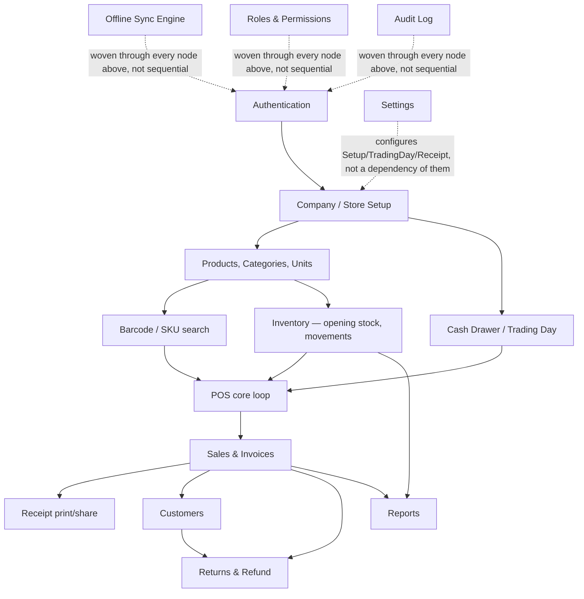

# Dependency Graph

> **Status:** 🔵 In review
> **Phase:** 16 — Milestones
> **Version:** 0.1.0
> **Last updated:** 2026-07-31
> **Owner:** CTO
> **Approved by:** _pending_

Which modules block which — the true critical path — for [scope-and-release-slices.md](../01-vision/scope-and-release-slices.md)'s
16 V1 modules, and the concrete basis [milestones.md](milestones.md)'s M0–M4 ordering was derived
from, not an arbitrary equal split of the module list.

---

## 1. The graph

## 2. The critical path, named explicitly

**Authentication → Company/Store Setup → Products/Categories/Units → Inventory (opening stock) →
POS core loop → Sales & Invoices → Receipt.** This is the longest genuinely sequential chain — every
node depends on the one before it existing first, and nothing later in
[scope-and-release-slices.md](../01-vision/scope-and-release-slices.md)'s V1 list can be built
before this chain completes, because nothing can be sold without a product, no product can be sold
without stock accounting for it, and no sale is complete without a receipt.

**Cash Drawer / Trading Day is a parallel dependency, not part of the critical path itself** — it
gates POS (a sale cannot complete without an open trading day, per
[sales.md](../11-api/endpoints/sales.md)'s `TRADING_DAY_NOT_OPEN` check) but has no dependency on
Products/Inventory, so it can be built concurrently with the Catalogue/Inventory branch without
lengthening the path.

**Customers, Returns, and Reports all branch off *after* Sales & Invoices** and have no dependency on
each other — they can be built in any order, or in parallel by more than one contributor, once the
critical path reaches `Sales`.

## 3. The three cross-cutting concerns — deliberately not on the critical path

**Offline Sync Engine, Roles & Permissions, and Audit Log are not sequential milestones** — per
[scope-and-release-slices.md §3](../01-vision/scope-and-release-slices.md#3-ordering-rationale)'s
own rule ("audit logging and multi-tenancy ship in V1 regardless of scope pressure... retro-fit
impossible") and this phase's own M0 rule (the offline sync engine is "architecture, not a feature,
cannot be added later"), all three are **woven into every node on the critical path from M0
onward**, never deferred to a later milestone waiting for "the sync milestone" or "the roles
milestone" to arrive. This is exactly why [milestones.md](milestones.md)'s M0 already includes a
minimal sync path and a minimal audit-log write, not just the Auth→Sale→Receipt chain in isolation.

## 4. Settings — a configuration input, not a graph dependency

`Settings` (tax mode, currency, printer, receipt template) is consumed by several nodes (`Setup`,
`TradingDay`, `Receipt`) but has no module that depends on *building* it first in the traditional
sense — its fields simply need sensible defaults present from `Setup` onward, with the actual
settings **screen** buildable at any point M0–M4 without blocking anything else, per
[settings.md](../11-api/endpoints/settings.md)'s already-fixed shape.

## Change Log

| Version | Date | Change |
| --- | --- | --- |
| 0.1.0 | 2026-07-31 | Full V1 dependency graph; critical path named (Auth→Setup→Catalogue→Inventory→POS→Sales→Receipt); Trading Day identified as parallel, not sequential; Sync/Roles/Audit confirmed as cross-cutting from M0, not later milestones. |
